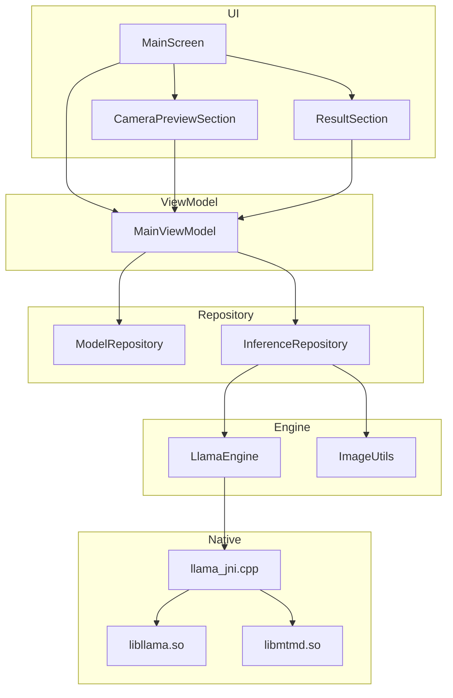
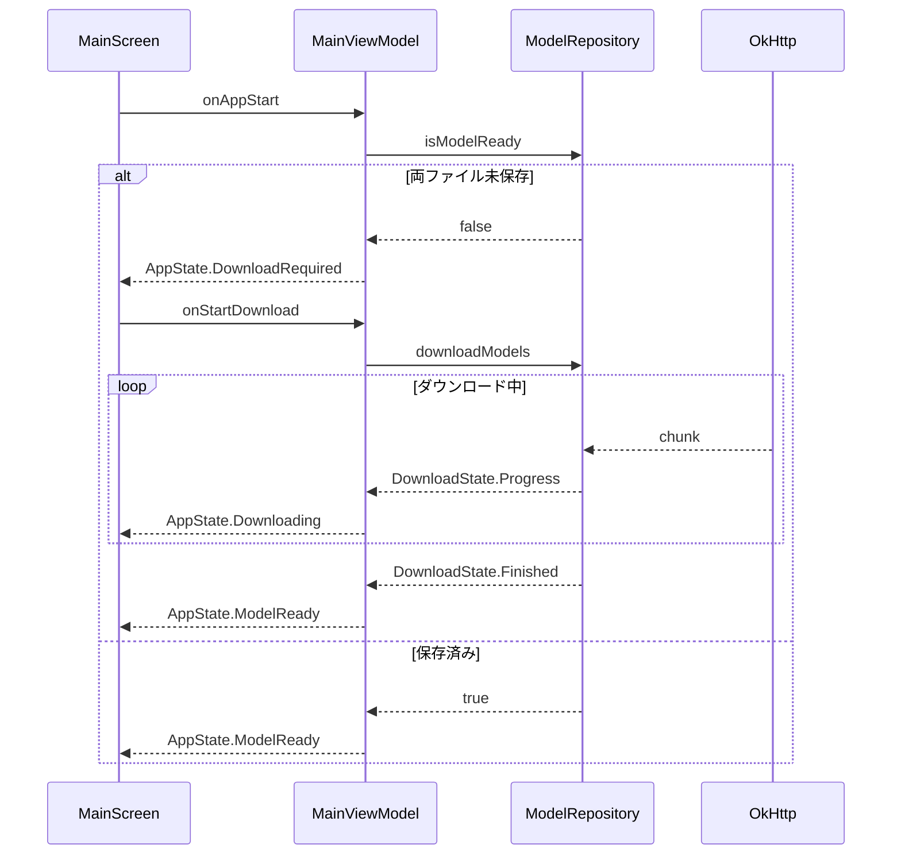
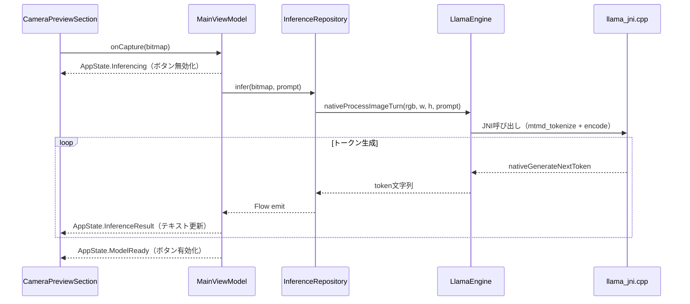
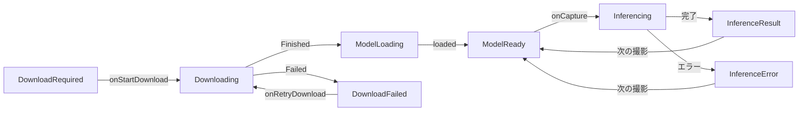

# 設計書: gemma4-camera-viewer

## Overview

本フィーチャーは、Gemma 4 E2B（Effective 2B）のマルチモーダル推論能力をAndroid実機でオフライン検証するアプリ「Gemma4CameraViewer」を提供する。llama.cpp（libmtmd）をAndroid NDK経由でKotlinから呼び出し、CameraXで撮影した画像をGemma 4 E2B GGUFモデルに入力して日本語解説を生成し、Jetpack Compose UIに表示する。

**ユーザー**: Gemma 4 E2Bの有効性を検証したい開発者・研究者。初回起動時にモデルファイル（合計約2.8GB）をHuggingFaceからダウンロードし、以降はオフラインで動作する。

### Goals
- Gemma 4 E2B（Q4_K_M GGUF）を使用したオンデバイスマルチモーダル推論の実現
- CameraXで撮影した画像に対する日本語物体認識・解説の生成
- 初回ダウンロード後の完全オフライン動作

### Non-Goals
- 音声入出力（Gemma 4のオーディオエンコーダは使用しない）
- 複数画像の比較・会話履歴の保持
- Google Play配布・iOS対応・モデルのファインチューニング

## Boundary Commitments

### This Spec Owns
- Androidアプリの全コード（UI / ViewModel / Repository / JNIブリッジ）
- llama.cppのAndroid向けCMakeビルド設定
- Gemma 4 E2B GGUFの初回ダウンロードとローカルキャッシュ管理
- CameraXによる撮影機能とBitmapのRGB変換
- libmtmd経由のマルチモーダル推論（テキスト生成ループ含む）

### Out of Boundary
- Gemma 4 E2B GGUFモデルファイルのホスティング（HuggingFace / Unsloth管理）
- llama.cpp本体ソースコード（サブモジュール/依存として使用）
- Android OSのカメラドライバ・NDKツールチェーン本体

### Allowed Dependencies
- `ggml-org/llama.cpp`（master、April 2025以降ビルド。Gemma 4サポート確認済み）
- `androidx.camera:camera-*:1.5.x`（Compose native API含む）
- `com.squareup.okhttp3:okhttp:4.x`
- Jetpack Compose BOM 2025.x
- Android NDK 29.x / CMake 3.31.x

### Revalidation Triggers
- llama.cpp mtmd.h APIの破壊的変更
- Gemma 4 GGUFフォーマットまたはmmprojファイル形式の変更
- CameraX 2.x へのメジャーバージョンアップ
- MinSDK変更（現在33）

## Architecture

### Architecture Pattern & Boundary Map



依存方向: `Native → Engine → Repository → ViewModel → UI`。各レイヤーは左から右方向のみ参照する。

### Technology Stack

| レイヤー | 選択 / バージョン | 役割 |
|---------|-----------------|------|
| UI | Jetpack Compose BOM 2025.x + camera-compose 1.5.x | 分割レイアウト・カメラプレビュー・テキスト表示 |
| ViewModel | AndroidX ViewModel + Kotlin Coroutines + StateFlow | 状態管理・非同期制御 |
| Camera | CameraX 1.5.x（Preview + ImageCapture） | ライブプレビュー・静止画取得 |
| HTTP | OkHttp 4.x | GGUFファイルのレジューム対応ダウンロード |
| Native Bridge | NDK 29 + CMake 3.31 | llama.cppのAndroidビルド |
| 推論ランタイム | llama.cpp master（≥ April 2025）+ libmtmd | Gemma 4 E2Bマルチモーダル推論 |
| モデルファイル | GGUF Q4_K_M（メイン ~2.5GB）+ mmproj BF16（~300MB） | オンデバイスモデル |

## File Structure Plan

```
app/
├── build.gradle.kts                             # Android依存・NDK・CMake設定
├── src/main/
│   ├── AndroidManifest.xml                      # CAMERA + INTERNET権限
│   ├── cpp/
│   │   ├── CMakeLists.txt                       # llama.cpp + mtmd ビルド定義
│   │   └── llama_jni.cpp                        # 全JNI関数実装（テキスト + マルチモーダル）
│   └── kotlin/com/example/gemma4viewer/
│       ├── MainActivity.kt                      # エントリポイント・カメラ権限要求
│       ├── ModelConfig.kt                       # モデルURL・ファイル名定数
│       ├── ui/
│       │   ├── MainScreen.kt                    # ルートComposable（上下分割レイアウト）
│       │   ├── CameraPreviewSection.kt          # カメラプレビュー・撮影ボタン
│       │   └── ResultSection.kt                 # テキスト表示エリア（スクロール可）
│       ├── viewmodel/
│       │   └── MainViewModel.kt                 # AppState管理・フロー統合
│       ├── repository/
│       │   ├── ModelRepository.kt               # モデル存在確認・OkHttpダウンロード
│       │   └── InferenceRepository.kt           # LlamaEngine呼び出しラッパー
│       ├── engine/
│       │   └── LlamaEngine.kt                   # JNIネイティブ関数宣言・loadLibrary
│       └── util/
│           └── ImageUtils.kt                    # Bitmap → RGB ByteArray変換
```

## System Flows

### モデル起動フロー



### 撮影・推論フロー



## Requirements Traceability

| 要件 | 概要 | コンポーネント | インターフェース | フロー |
|------|------|--------------|----------------|--------|
| 1.1–1.4 | 画面分割・プレビュー・スクロール・ボタン配置 | MainScreen, CameraPreviewSection, ResultSection | AppState | - |
| 2.1–2.3 | 撮影・推論中無効化・推論入力渡し | CameraPreviewSection, MainViewModel | onCapture(), AppState.Inferencing | 撮影・推論フロー |
| 3.1–3.5 | 自動DL開始・進捗表示・保存・再利用・再試行 | ModelRepository, MainViewModel | DownloadState, isModelReady() | モデル起動フロー |
| 4.1–4.5 | 推論開始・ローディング・日本語表示・オンデバイス・エラー | InferenceRepository, LlamaEngine, llama_jni.cpp | Flow\<String\>, nativeProcessImageTurn() | 撮影・推論フロー |
| 5.1–5.2 | オフライン完結・履歴なし | ModelRepository, InferenceRepository | - | - |

## Components and Interfaces

### コンポーネント概要

| コンポーネント | レイヤー | 役割 | 要件 | 主要依存（優先度） |
|--------------|---------|------|------|----------------|
| MainScreen | UI | 上下分割レイアウト | 1.1–1.3 | MainViewModel (P0) |
| CameraPreviewSection | UI | カメラ表示・撮影ボタン | 1.4, 2.1–2.3 | CameraX (P0), MainViewModel (P0) |
| ResultSection | UI | 結果テキスト表示 | 1.3, 4.2–4.3, 4.5 | MainViewModel (P0) |
| MainViewModel | ViewModel | AppState統合管理 | 全要件 | ModelRepository (P0), InferenceRepository (P0) |
| ModelRepository | Repository | DL・キャッシュ管理 | 3.1–3.5, 5.1 | OkHttp (P0) |
| InferenceRepository | Repository | 推論APIラッパー | 4.1–4.5, 5.2 | LlamaEngine (P0), ImageUtils (P0) |
| LlamaEngine | Engine | JNIネイティブ宣言 | 4.1–4.4 | llama_jni.cpp (P0) |
| ImageUtils | Utility | Bitmap変換 | 4.1 | - |
| llama_jni.cpp | Native | JNIブリッジ実装 | 4.1–4.4 | libllama, libmtmd (P0) |

---

### UI層

UIコンポーネントはロジックを持たず、`MainViewModel` の `StateFlow<AppState>` を観察してUIを再構成する。

#### MainScreen

| Field | Detail |
|-------|--------|
| Intent | 画面を上下50:50に分割し、CameraPreviewSectionとResultSectionを配置する |
| Requirements | 1.1, 1.2, 1.3 |

**Implementation Notes**
- `Column` + `Modifier.weight(0.5f)` で均等分割
- `AppState.DownloadRequired` / `Downloading` / `DownloadFailed` 時は全面にダウンロードUIを表示
- `AppState.ModelLoading` 時はモデル初期化中インジケータを表示

#### CameraPreviewSection

| Field | Detail |
|-------|--------|
| Intent | CameraXプレビューと撮影ボタンを表示。推論中はボタンをdisabledにする |
| Requirements | 1.4, 2.1, 2.2, 2.3 |

**Implementation Notes**
- `CameraXViewfinder(surfaceRequest)` でCompose nativeプレビュー（camera-compose 1.5）
- 撮影ボタン: `enabled = appState !is AppState.Inferencing`
- 撮影: `ImageCapture.takePicture → imageProxy.toBitmap() → vm.onCapture(bitmap)` 後に `imageProxy.close()` を必須呼び出し
- `ProcessCameraProvider` はLifecycleOwnerにバインド（`bindToLifecycle`）

#### ResultSection

| Field | Detail |
|-------|--------|
| Intent | 推論結果テキストをスクロール可能エリアに表示。推論中はローディングインジケータを表示する |
| Requirements | 1.3, 4.2, 4.3, 4.5 |

**Implementation Notes**
- `verticalScroll(rememberScrollState())` でスクロール実現
- `AppState.Inferencing` 時: `CircularProgressIndicator` を表示
- `AppState.InferenceResult(text)` 時: テキストを表示（トークンが追加されるたびに更新）
- `AppState.InferenceError(message)` 時: エラーメッセージを日本語で表示

---

### ViewModel層

#### MainViewModel

| Field | Detail |
|-------|--------|
| Intent | AppStateを一元管理し、ダウンロード・撮影・推論の非同期フローを統合する |
| Requirements | 全要件 |

**Contracts**: State [✓]

##### State Management

```kotlin
sealed class AppState {
    object DownloadRequired : AppState()
    data class Downloading(val progress: Int, val label: String) : AppState()
    data class DownloadFailed(val error: String) : AppState()
    object ModelLoading : AppState()
    object ModelReady : AppState()
    object Inferencing : AppState()
    data class InferenceResult(val text: String) : AppState()
    data class InferenceError(val message: String) : AppState()
}

class MainViewModel(
    private val modelRepo: ModelRepository,
    private val inferenceRepo: InferenceRepository
) : ViewModel() {
    val appState: StateFlow<AppState>

    fun onAppStart()                    // モデル存在確認 → DL or ロード
    fun onStartDownload()               // ダウンロード開始
    fun onRetryDownload()               // 再試行（DownloadFailed状態から）
    fun onCapture(bitmap: Bitmap)       // 撮影完了→推論開始
}
```

- `onCapture()` は `viewModelScope.launch(Dispatchers.IO)` で実行
- トークンストリーミング: `InferenceRepository.infer()` の `Flow<String>` を `collect` し、`appState` を逐次 `InferenceResult(text)` で更新
- 推論完了後: `appState = ModelReady`（ボタン再有効化）

---

### Repository層

#### ModelRepository

| Field | Detail |
|-------|--------|
| Intent | モデルファイル（main GGUF + mmproj）の存在確認とOkHttpによるレジューム対応ダウンロード |
| Requirements | 3.1, 3.2, 3.3, 3.4, 3.5, 5.1 |

**Contracts**: Service [✓]

##### Service Interface

```kotlin
interface ModelRepository {
    fun isModelReady(): Boolean                    // 両ファイルのfilesDir存在確認
    fun downloadModels(): Flow<DownloadState>       // model + mmproj 順次DL
    fun getModelPath(): String                     // filesDir/model.gguf の絶対パス
    fun getMmprojPath(): String                    // filesDir/mmproj.gguf の絶対パス
}

sealed class DownloadState {
    data class Progress(val percent: Int, val label: String) : DownloadState()
    object Finished : DownloadState()
    data class Failed(val error: Throwable) : DownloadState()
}
```

**Implementation Notes**
- ダウンロードURL: `ModelConfig.MODEL_URL` / `ModelConfig.MMPROJ_URL` 定数で管理
- OkHttp `Range: bytes=N-` ヘッダー + append mode (`FileOutputStream(file, true)`) でレジューム
- `contentLength() == -1`（chunked）の場合: `Progress(percent = -1, ...)` でUI側は「ダウンロード中」表示
- 2ファイル順次DL: `label` に「モデルファイル」「mmprojファイル」を設定して区別
- ストレージ権限不要（`context.filesDir` のみ使用）

#### InferenceRepository

| Field | Detail |
|-------|--------|
| Intent | LlamaEngineの初期化・推論・後処理を管理し、トークンをFlowで提供する |
| Requirements | 4.1, 4.2, 4.3, 4.4, 4.5, 5.2 |

**Contracts**: Service [✓]

##### Service Interface

```kotlin
interface InferenceRepository {
    suspend fun initialize(modelPath: String, mmprojPath: String)
    fun infer(bitmap: Bitmap, prompt: String): Flow<String>
    suspend fun release()
}
```

**Implementation Notes**
- `initialize()`: `Dispatchers.IO` で `nativeLoad → nativePrepare → nativeLoadMmproj` を順次呼び出し
- `infer()`: `bitmap.toRgbByteArray()` でRGB変換 → `nativeProcessImageTurn(rgb, w, h, prompt)` → `generateNextToken()` ループ
- Gemma 4固有パラメータ: `nCtx = 4096`、`nThreads = min(availableProcessors, 8)`
- プロンプトテンプレート（固定）:
  ```
  <start_of_turn>user
  この画像に写っているものを日本語で詳しく説明してください。
  <end_of_turn>
  <start_of_turn>model
  ```
- 推論結果はstreamingとしてemit。空文字受信でループ終了
- 会話履歴は保持しない（各推論でKVキャッシュをリセット）— 要件5.2

---

### Engine層

#### LlamaEngine

| Field | Detail |
|-------|--------|
| Intent | llama.cpp / libmtmd JNI関数のKotlinネイティブ宣言とSystem.loadLibraryエントリポイント |
| Requirements | 4.1–4.4 |

**Contracts**: Service [✓]

```kotlin
class LlamaEngine {
    companion object {
        init { System.loadLibrary("llama-jni") }
    }

    // テキストモデル初期化
    external fun nativeLoad(modelPath: String): Int      // 0=OK, 1=失敗
    external fun nativePrepare(nCtx: Int, nThreads: Int): Int
    external fun nativeSystemInfo(): String

    // マルチモーダル初期化
    external fun nativeLoadMmproj(mmprojPath: String): Int

    // 推論
    external fun nativeProcessImageTurn(
        rgbBytes: ByteArray, width: Int, height: Int, prompt: String
    ): Int

    external fun nativeGenerateNextToken(): String       // EOS時は空文字を返す

    // クリーンアップ
    external fun nativeUnload()
}
```

---

### Native層

#### llama_jni.cpp

| Field | Detail |
|-------|--------|
| Intent | llama.cpp + libmtmd APIをAndroid JNI経由でKotlinに公開するCブリッジ |
| Requirements | 4.1–4.4 |

**Implementation Notes**
- グローバル変数: `g_model`（llama_model*）, `g_ctx`（llama_context*）, `g_sampler`（llama_sampler*）, `g_mtmd_ctx`（mtmd_context*）, `g_batch`（llama_batch）
- `nativeProcessImageTurn`:
  1. JNIバイト配列 → `mtmd_bitmap_init(width, height, rgb_bytes)` でビットマップ作成
  2. `mtmd_input_text` でプロンプト設定（`image_min_tokens = 0` ← クラッシュ回避必須）
  3. `mtmd_tokenize → mtmd_encode_chunk`（画像チャンクをエンコード）
  4. テキストチャンクを `llama_decode` でKVキャッシュに積む
- `nativeGenerateNextToken`: `llama_sampler_sample → llama_decode（1トークン）→ token文字列返却`
- Gemma 4 M-RoPE: `mtmd_decode_use_mrope()` が `true` を返すため、デコードループで `mtmd_image_tokens_get_decoder_pos()` で3Dロープポジションを設定
- スレッド安全性: Kotlin側が `Dispatchers.IO` から呼び出すため、C層でのロック不要

#### CMakeLists.txt / build.gradle.kts（主要設定）

```cmake
# CMakeLists.txt（抜粋）
add_subdirectory(${LLAMA_CPP_ROOT} llama-build)
add_library(llama-jni SHARED llama_jni.cpp)
target_link_libraries(llama-jni llama mtmd common android log)
```

```kotlin
// build.gradle.kts（抜粋）
android {
    defaultConfig {
        minSdk = 33
        ndk { abiFilters += listOf("arm64-v8a") }
        externalNativeBuild {
            cmake {
                arguments(
                    "-DBUILD_SHARED_LIBS=ON",
                    "-DLLAMA_BUILD_COMMON=ON",
                    "-DGGML_BACKEND_DL=ON",
                    "-DGGML_CPU_ALL_VARIANTS=ON",  // Armv8.2+最適化・BF16エミュレーション
                    "-DGGML_OPENMP=OFF",           // Android OpenMP非安定
                    "-DLLAMA_BUILD_TESTS=OFF",
                    "-DLLAMA_BUILD_EXAMPLES=OFF"
                )
            }
        }
    }
    ndkVersion = "29.0.13113456"
}
```

---

### Utility

#### ImageUtils

**Contracts**: Service [✓]

```kotlin
object ImageUtils {
    fun Bitmap.toRgbByteArray(): ByteArray {
        val pixels = IntArray(width * height)
        getPixels(pixels, 0, width, 0, 0, width, height)
        val rgb = ByteArray(width * height * 3)
        for (i in pixels.indices) {
            rgb[i * 3]     = ((pixels[i] shr 16) and 0xFF).toByte()
            rgb[i * 3 + 1] = ((pixels[i] shr 8)  and 0xFF).toByte()
            rgb[i * 3 + 2] = (pixels[i]           and 0xFF).toByte()
        }
        return rgb
    }
}
```

## Data Models

### AppState遷移



## Error Handling

### エラーカテゴリと対応

| エラー種別 | 発生箇所 | AppState遷移 | ユーザー向け対応 |
|----------|---------|------------|--------------|
| ダウンロード失敗（ネットワーク断） | ModelRepository | DownloadFailed | エラーメッセージ + 再試行ボタン |
| ダウンロード失敗（HTTP 4xx/5xx） | ModelRepository | DownloadFailed | 同上。HTTPステータス表示 |
| モデルロード失敗（ファイル破損） | LlamaEngine | InferenceError | ファイル削除して再ダウンロード案内 |
| 推論JNIエラー | InferenceRepository | InferenceError | 日本語エラーメッセージ表示 |
| カメラ権限拒否 | MainActivity | - | 権限説明ダイアログ → 設定画面誘導 |
| 撮影失敗（ImageCaptureException） | CameraPreviewSection | - | トースト表示（再撮影促す） |

## Testing Strategy

### ユニットテスト
1. `ModelRepository.isModelReady()` — 両ファイル存在/片方欠損/両方欠損の3パターン判定
2. `ImageUtils.toRgbByteArray()` — 既知のピクセル値を持つBitmapから期待するRGBバイト列への変換精度
3. `MainViewModel` AppState遷移 — `DownloadRequired → Downloading → ModelReady` および `Inferencing → InferenceResult` の状態機械

### 統合テスト
1. `ModelRepository.downloadModels()` — MockWebServerを使ったDL完了・進捗・レジューム動作確認
2. `MainViewModel.onCapture()` — `InferenceRepository` をモックした撮影→推論開始→結果表示の統合フロー
3. カメラ権限拒否時のUI分岐 — `ActivityResultContracts` モックによる権限拒否シミュレーション

### E2Eテスト（実機：Pixel 10）
1. **初回起動ダウンロードフロー**: アプリ初回起動 → ダウンロード進捗表示 → 完了 → カメラプレビュー表示
2. **撮影・推論フロー**: 撮影ボタン押下 → ローディング表示・ボタン無効化 → 日本語テキスト表示 → ボタン再有効化
3. **オフライン動作確認**: 機内モード有効状態で撮影 → 推論 → テキスト表示が成功すること

### パフォーマンス
1. 推論レイテンシ: Pixel 10で撮影から最初のトークン表示まで30秒以内（Q4_K_M / `nCtx=4096`）
2. メモリ使用量: モデルロード後のRSSが9GB未満（12GBデバイスでの安定動作確認）

## Security Considerations

- 使用権限は `CAMERA` と `INTERNET` のみ。外部ストレージ権限は不要
- モデルファイルは `context.filesDir`（アプリプライベート領域）に保存。他アプリからアクセス不可
- 推論はオンデバイスのみ。カメラ画像・テキストは外部サーバーに送信しない（要件4.4）
- ダウンロードURLはHTTPS必須（`ModelConfig` 定数でhttp://を禁止）

## Performance & Scalability

- ターゲット端末: Pixel 10（RAM 12GB、Tensor G5、Android 15 / API 35）
- モデル合計サイズ: Q4_K_M GGUF ~2.5GB + mmproj BF16 ~300MB = 約2.8GB
- `nCtx = 4096`（1画像あたり ~768トークン + プロンプト + レスポンスに十分）
- 推論スレッド数: `min(Runtime.getRuntime().availableProcessors(), 8)`
- `GGML_CPU_ALL_VARIANTS=ON` でArmv8.2+ 最適化パスを自動選択（BF16エミュレーション含む）
- GPU Vulkanアクセラレーション: `GGML_VULKAN=ON` を将来的に試験可能（本設計スコープ外）
