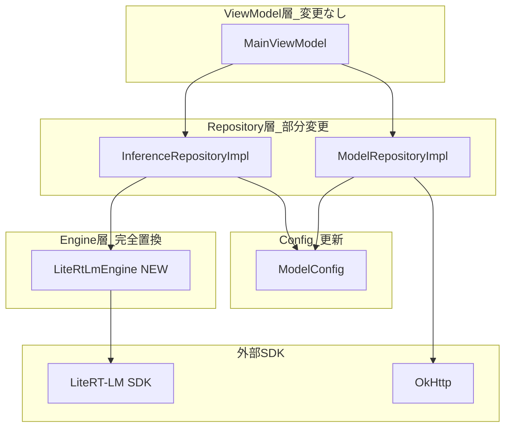
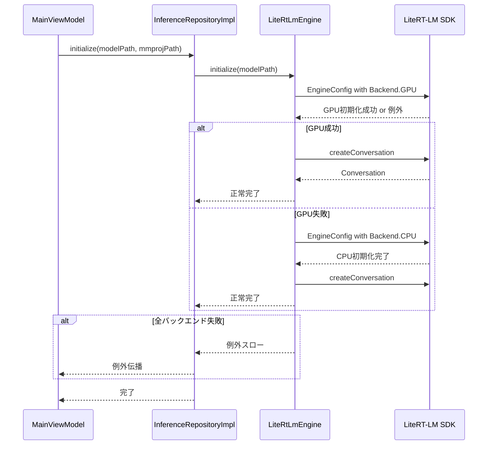
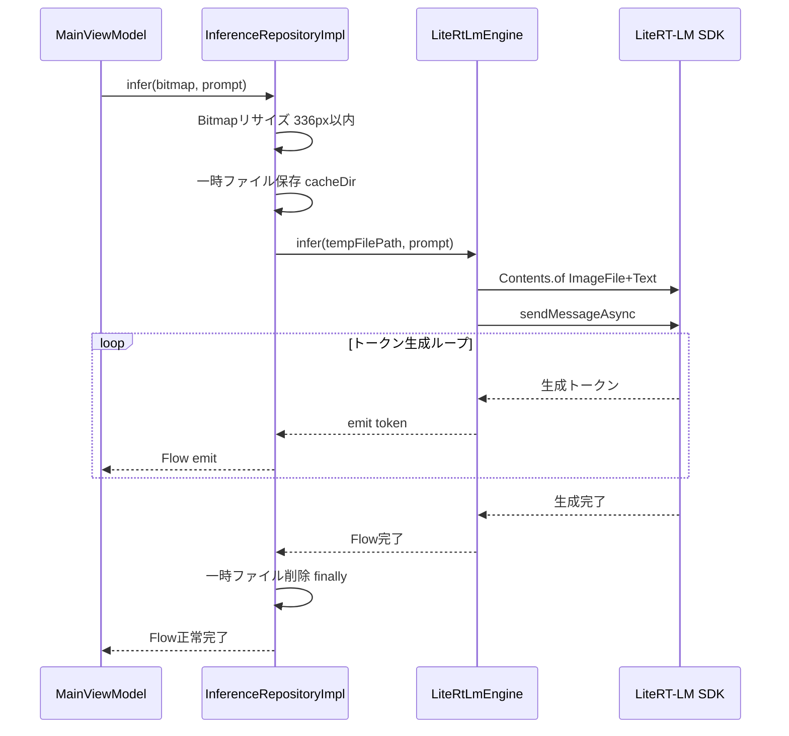
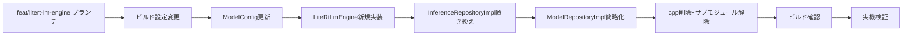

# Design Document: litert-lm-engine

## Overview

本機能は、既存の llama.cpp + JNI 推論スタックを Google AI Edge LiteRT-LM Kotlin SDK に完全置き換えし、Gemma 4 E2B マルチモーダルモデル（`.litertlm` 形式）をオンデバイス GPU 推論で動作させる。対象ユーザーは「korenani?」アプリのエンドユーザーであり、カメラ撮影画像に対する日本語テキスト生成の速度・安定性・メモリ効率を大幅に改善する。

現在の llama.cpp スタックでは CPU のみで推論し（< 1 tok/s）、KV キャッシュ + モデル + mmproj の合計メモリが約 5 GB に達し Android デバイスで OOM が頻発している。LiteRT-LM 移行により、GPU バックエンドで 52 tok/s・モデルメモリ 676 MB を実現し、NDK/CMake/JNI に起因するビルド複雑性も排除する。

本スペックは推論エンジン層・モデル管理層・ビルド設定の置き換えのみを担う。UI・ViewModel・DownloadState・InferenceRepository インターフェースは変更しない。

### Goals
- LiteRT-LM SDK で Gemma 4 E2B `.litertlm` 単一ファイルのオンデバイス推論を実現する
- GPU バックエンド優先（失敗時は CPU フォールバック）で高速・低メモリ推論を実現する
- NDK/CMake/JNI ビルドを完全排除し、標準 Gradle ビルドのみで完結させる
- `InferenceRepository` インターフェースを維持し、ViewModel 層への影響をゼロにする

### Non-Goals
- UI コンポーネント・AppState・MainViewModel の変更
- ダウンロード UI・プログレス表示の変更
- OkHttp ダウンロード実装の変更
- モデル量子化・変換処理
- llama.cpp スタックとの共存・A/B 切り替え

## Boundary Commitments

### This Spec Owns
- `LiteRtLmEngine`（LiteRT-LM `Engine` + `Conversation` ラッパー）の新規実装
- `InferenceRepositoryImpl` の LiteRT-LM API 呼び出しへの置き換え
- `ModelConfig` 定数（URL・ファイル名）の `.litertlm` 形式への更新
- `ModelRepositoryImpl` の単一ファイルダウンロードへの簡略化
- `app/build.gradle.kts` の NDK/CMake 設定削除と LiteRT-LM Gradle 依存追加
- `app/src/main/cpp/` ディレクトリ（JNI ソース・llama.cpp サブモジュール参照）の完全削除
- `engine/LlamaEngine.kt` の削除
- 画像一時ファイル保存処理（`Content.ImageFile` がファイルパスを要求するため）

### Out of Boundary
- `InferenceRepository` インターフェース定義（変更しない）
- `ModelRepository` インターフェース定義（変更しない）
- `DownloadState` sealed class 定義（変更しない）
- `AppState` sealed class 定義（変更しない）
- `MainViewModel` ロジック（変更しない）
- UI コンポーネント（`MainScreen`、`CameraPreviewSection` 等）
- OkHttp ダウンロード実装（継続使用）
- テーマ・アイコン・アプリ名

### Allowed Dependencies
- Google AI Edge LiteRT-LM Kotlin SDK（`com.google.ai.edge.litertlm:litertlm-android`）
- 既存の OkHttp（ダウンロード継続使用）
- Kotlin Coroutines / Flow（既存パターン継続）
- Android `Context.cacheDir` / `File`（一時画像ファイル管理）
- `InferenceRepository`・`ModelRepository` インターフェース（実装クラスから参照）

### Revalidation Triggers
- `InferenceRepository.initialize()` / `infer()` / `release()` のシグネチャ変更
- `DownloadState` の状態定義変更
- LiteRT-LM SDK のメジャーバージョンアップ（API 破壊的変更）
- `.litertlm` モデルファイルの URL・フォーマット変更

## Architecture

### Existing Architecture Analysis

現在のアーキテクチャは以下の層構成を持つ：
- **ViewModel 層**: `MainViewModel` が `InferenceRepository` / `ModelRepository` を DI 経由で使用
- **Repository 層**: `InferenceRepositoryImpl`（LlamaEngine 呼び出し）、`ModelRepositoryImpl`（OkHttp ダウンロード）
- **Engine 層**: `LlamaEngine`（JNI 宣言）→ `app/src/main/cpp/llama_jni.cpp`（C++ JNI ブリッジ）→ llama.cpp サブモジュール
- **Config**: `ModelConfig`（2 ファイル：model.gguf + mmproj.gguf の URL・ファイル名定数）

本スペックでは Engine 層を LiteRT-LM SDK に置き換え、Repository 層も対応する API に変更する。ViewModel 層・インターフェース定義は一切変更しない。

### Architecture Pattern & Boundary Map



**依存方向**: Config → Engine → Repository → ViewModel（一方向のみ。逆方向の依存は禁止）

**アーキテクチャ決定事項**:
- `LiteRtLmEngine` を `InferenceRepositoryImpl` から切り離した専用クラスとして実装する（Engine ライフサイクル管理・GPU/CPU フォールバックロジックを Repository から分離し、テスト容易性を高める）
- `mmprojPath` 引数は `initialize()` で受け取るが内部では使用しない（API 互換性維持）
- Bitmap → 一時ファイル変換は `InferenceRepositoryImpl` 内で実施（`LiteRtLmEngine` は path のみ受け取り、Android Context に非依存）

### Technology Stack

| 層 | 選択 / バージョン | 役割 | 備考 |
|---|---|---|---|
| 推論エンジン SDK | `com.google.ai.edge.litertlm:litertlm-android:latest.release` | GPU/CPU 推論、マルチモーダル対応 | Kotlin Stable; 実装時に具体バージョン（0.10.1 以降）を確認 |
| ネットワーク | OkHttp（既存） | モデルダウンロード（Resume 対応） | 変更なし |
| 非同期処理 | Kotlin Coroutines / Flow（既存） | 推論ストリーミング、ダウンロード進捗 | 変更なし |
| ビルドシステム | Gradle（NDK/CMake を削除） | APK ビルド | `externalNativeBuild` / `ndk` ブロック完全削除 |

## File Structure Plan

### Directory Structure

```
app/
├── build.gradle.kts                                       # 変更: NDK/CMake削除, LiteRT-LM依存追加
├── src/
│   ├── main/
│   │   ├── cpp/                                           # 削除: llama.cpp JNIソース・サブモジュール全体
│   │   └── kotlin/com/example/gemma4viewer/
│   │       ├── ModelConfig.kt                             # 変更: .litertlm URL・ファイル名に更新
│   │       ├── engine/
│   │       │   ├── LlamaEngine.kt                         # 削除: JNI宣言クラス
│   │       │   └── LiteRtLmEngine.kt                      # 新規: LiteRT-LM Engine+Conversationラッパー
│   │       └── repository/
│   │           ├── InferenceRepositoryImpl.kt             # 変更: LiteRtLmEngine使用・一時ファイル処理
│   │           └── ModelRepositoryImpl.kt                 # 変更: 単一ファイルダウンロードに簡略化
│   └── test/
│       └── kotlin/com/example/gemma4viewer/
│           ├── ModelConfigTest.kt                         # 変更: 新URLとファイル名を検証
│           └── engine/
│               └── LiteRtLmEngineTest.kt                  # 新規: GPU/CPUフォールバック等のユニットテスト
```

### Modified Files
- `app/build.gradle.kts` — `externalNativeBuild`・`ndk`・CMake 引数ブロックを削除し、`implementation("com.google.ai.edge.litertlm:litertlm-android:latest.release")` を追加
- `app/src/main/kotlin/com/example/gemma4viewer/ModelConfig.kt` — `MODEL_URL` と `MODEL_FILENAME` を `.litertlm` 形式に更新。`MMPROJ_URL`・`MMPROJ_FILENAME` は互換性のため空文字定数として維持
- `app/src/main/kotlin/com/example/gemma4viewer/repository/InferenceRepositoryImpl.kt` — `LlamaEngine` 参照を `LiteRtLmEngine` に置き換え。`nativeLibDir` パラメータを削除。Bitmap→一時ファイル変換ロジックを追加
- `app/src/main/kotlin/com/example/gemma4viewer/repository/ModelRepositoryImpl.kt` — `isModelReady()` を `.litertlm` ファイル単一存在確認に変更。`getMmprojPath()` は `""` 返却に変更（互換性維持）

## System Flows

### エンジン初期化フロー（要件 2）



### マルチモーダル推論フロー（要件 3）



## Requirements Traceability

| 要件 ID | 概要 | コンポーネント | インターフェース | フロー |
|---|---|---|---|---|
| 1.1 | 単一 .litertlm ファイル管理 | ModelConfig, ModelRepositoryImpl | ModelRepository | - |
| 1.2 | ファイル存在確認（size > 0） | ModelRepositoryImpl | isModelReady() | - |
| 1.3 | ダウンロード進捗の定期更新 | ModelRepositoryImpl | downloadModels(): Flow<DownloadState> | - |
| 1.4 | ダウンロード完了で Finished emit | ModelRepositoryImpl | DownloadState.Finished | - |
| 1.5 | ネットワーク/HTTP エラーで Failed emit | ModelRepositoryImpl | DownloadState.Failed | - |
| 1.6 | 部分ダウンロードを Range で Resume | ModelRepositoryImpl | OkHttp Range ヘッダー | - |
| 1.7 | モデルパスを推論エンジンに提供 | ModelRepositoryImpl, InferenceRepositoryImpl | getModelPath() | 初期化フロー |
| 2.1 | GPU バックエンド優先初期化 | LiteRtLmEngine | initialize(modelPath) | 初期化フロー |
| 2.2 | GPU 失敗時 CPU フォールバック | LiteRtLmEngine | initialize(modelPath) | 初期化フロー |
| 2.3 | 初期化成功で infer 受付可能状態 | LiteRtLmEngine | isInitialized 内部フラグ | - |
| 2.4 | 全バックエンド失敗で例外スロー | LiteRtLmEngine | initialize() 例外伝播 | 初期化フロー |
| 2.5 | release() でリソース解放 | LiteRtLmEngine | release() | - |
| 3.1 | 画像一時ファイル保存→SDK 送信 | InferenceRepositoryImpl | infer(bitmap, prompt) | 推論フロー |
| 3.2 | トークン逐次 Flow emit | InferenceRepositoryImpl, LiteRtLmEngine | Flow<String> | 推論フロー |
| 3.3 | 生成完了で Flow 正常終了 | LiteRtLmEngine | sendMessageAsync 完了 | 推論フロー |
| 3.4 | 推論エラーで Flow 例外終了 | LiteRtLmEngine | sendMessageAsync 例外 | 推論フロー |
| 3.5 | 画像前処理（最大 336px リサイズ） | InferenceRepositoryImpl | scaleToMax(336) | - |
| 3.6 | 推論完了後に一時ファイル削除 | InferenceRepositoryImpl | finally ブロック | 推論フロー |
| 4.1 | LiteRT-LM を Gradle 依存のみで宣言 | build.gradle.kts | - | - |
| 4.2 | cpp/ ディレクトリ不含のビルド構成 | build.gradle.kts（CMake 削除） | - | - |
| 4.3 | C++ コンパイルなしに APK 生成 | build.gradle.kts | - | - |
| 5.1 | InferenceRepository シグネチャ不変 | InferenceRepositoryImpl | InferenceRepository | - |
| 5.2 | DownloadState 定義不変 | ModelRepositoryImpl | DownloadState | - |
| 5.3 | mmprojPath 引数受け取り・内部未使用 | InferenceRepositoryImpl | initialize(_, mmprojPath) | - |
| 5.4 | ModelRepository シグネチャ不変 | ModelRepositoryImpl | ModelRepository | - |

## Components and Interfaces

### コンポーネント一覧

| コンポーネント | 層 | 目的 | 要件カバレッジ | 主要依存 |
|---|---|---|---|---|
| LiteRtLmEngine | Engine | GPU/CPU バックエンド選択、推論実行 | 2.1–2.5, 3.2–3.4 | LiteRT-LM SDK (P0) |
| InferenceRepositoryImpl | Repository | InferenceRepository 実装、一時ファイル管理 | 3.1, 3.5, 3.6, 5.1, 5.3 | LiteRtLmEngine (P0) |
| ModelRepositoryImpl | Repository | 単一ファイルダウンロード、存在確認 | 1.1–1.7, 5.2, 5.4 | ModelConfig (P0), OkHttp (P1) |
| ModelConfig | Config | .litertlm URL・ファイル名定数 | 1.1, 1.7 | - |
| build.gradle.kts | ビルド設定 | LiteRT-LM 依存追加、NDK/CMake 削除 | 4.1–4.3 | - |

### Engine 層

#### LiteRtLmEngine

| フィールド | 詳細 |
|---|---|
| 目的 | LiteRT-LM `Engine` と `Conversation` のライフサイクルを管理し、GPU/CPU フォールバック・マルチモーダル推論を提供する |
| 要件 | 2.1, 2.2, 2.3, 2.4, 2.5, 3.2, 3.3, 3.4 |

**責務と制約**
- `initialize(modelPath)` で GPU 優先の `EngineConfig` を試行し、失敗時は CPU でリトライする
- `Conversation` インスタンスを保持し、`infer(imagePath, prompt)` でマルチモーダル推論を実行する
- `release()` で `Engine` リソースを解放し、以降の `infer` 呼び出しを不正状態から保護する
- スレッド安全性: `initialize` / `release` は呼び出し元（`Dispatchers.IO`）が保証する

**依存関係**
- External: `com.google.ai.edge.litertlm:litertlm-android` — `Engine`, `Conversation`, `Contents`, `Backend` クラス (P0)

**Contracts**: Service [x] / State [x]

##### Service Interface

```kotlin
class LiteRtLmEngine {
    // GPU優先初期化。GPU失敗時はCPUフォールバック。全失敗時は例外スロー。
    // 注意: 実装時にSDK正確なAPIシグネチャを公式ドキュメントで確認すること
    suspend fun initialize(modelPath: String)

    // マルチモーダル推論。imagePath は一時ファイルの絶対パス
    fun infer(imagePath: String, prompt: String): Flow<String>

    // エンジンリソース解放。以降のinfer呼び出しはIllegalStateExceptionをスロー
    suspend fun release()
}
```

- 事前条件: `infer` 呼び出し前に `initialize` が正常完了していること
- 事後条件: `release` 後の `infer` 呼び出しは `IllegalStateException` をスローする
- 不変条件: GPU 初期化失敗は CPU フォールバックで吸収し、呼び出し元に漏らさない（全バックエンド失敗時のみ例外）

**実装メモ**
- Integration: GPU/CPU 切り替えは try/catch で実装。`Backend.GPU()` で失敗した場合のみ `Backend.CPU()` にフォールバック
- Validation: `infer` 呼び出し時に初期化済みフラグを確認する
- Risks: GPU decode バグ（v0.10.0）があるため `latest.release` 使用時はバージョンを確認すること

### Repository 層

#### InferenceRepositoryImpl

| フィールド | 詳細 |
|---|---|
| 目的 | `InferenceRepository` インターフェースを実装し、Bitmap→一時ファイル変換・リサイズ・LiteRtLmEngine 呼び出しを担う |
| 要件 | 3.1, 3.5, 3.6, 5.1, 5.3 |

**責務と制約**
- `initialize(modelPath, mmprojPath)`: `mmprojPath` は受け取るが内部では使用しない。`engine.initialize(modelPath)` のみを呼ぶ
- `infer(bitmap, prompt)`: Bitmap を最大 336px にリサイズし JPEG として `cacheDir` に一時保存する。`finally` で一時ファイルを削除する
- 一時ファイルは推論ごとに固有名（タイムスタンプ）を使用する

**依存関係**
- Inbound: `MainViewModel` — `infer()` / `initialize()` / `release()` 呼び出し (P0)
- Outbound: `LiteRtLmEngine` — 推論実行 (P0)

**Contracts**: Service [x]

##### Service Interface（InferenceRepository 準拠）

```kotlin
class InferenceRepositoryImpl(
    private val engine: LiteRtLmEngine,
    private val cacheDir: File,
) : InferenceRepository {
    override suspend fun initialize(modelPath: String, mmprojPath: String)
    override fun infer(bitmap: Bitmap, prompt: String): Flow<String>
    override suspend fun release()

    companion object {
        private const val MAX_IMAGE_SIZE = 336
    }
}
```

**実装メモ**
- Integration: 一時ファイルは `File(cacheDir, "infer_${System.currentTimeMillis()}.jpg")` で生成
- Validation: 既存の `scaleToMax()` パターンで最大辺 336px に収める
- Risks: `finally` ブロックで確実にファイルを削除すること（正常・異常両方）

#### ModelRepositoryImpl

| フィールド | 詳細 |
|---|---|
| 目的 | `.litertlm` 単一ファイルのダウンロード管理と存在確認を提供する |
| 要件 | 1.1–1.7, 5.2, 5.4 |

**責務と制約**
- `isModelReady()`: `MODEL_FILENAME` のファイルが存在し `length() > 0` であれば `true`
- `downloadModels()`: `.litertlm` ファイル 1 件のみダウンロード。OkHttp + Range ヘッダーで Resume 対応
- `getMmprojPath()`: 空文字 `""` を返す（インターフェース互換性維持）
- ダウンロードロジック（OkHttp・Range・Progress emit）は既存実装を維持

**Contracts**: Service [x]

##### Service Interface（ModelRepository 準拠）

```kotlin
class ModelRepositoryImpl(
    private val filesDir: File,
    private val okHttpClient: OkHttpClient,
) : ModelRepository {
    override fun isModelReady(): Boolean         // MODEL_FILENAME 存在 + size > 0
    override fun downloadModels(): Flow<DownloadState>
    override fun getModelPath(): String          // filesDir/MODEL_FILENAME
    override fun getMmprojPath(): String         // "" （LiteRT-LM は単一ファイル）
}
```

### Config

#### ModelConfig

| フィールド | 詳細 |
|---|---|
| 目的 | Gemma 4 E2B `.litertlm` ファイルの URL とファイル名定数を提供する |
| 要件 | 1.1, 1.7 |

```kotlin
object ModelConfig {
    const val MODEL_URL = "https://huggingface.co/litert-community/gemma-4-E2B-it-litert-lm/resolve/main/gemma-4-E2B-it.litertlm"
    const val MODEL_FILENAME = "gemma-4-E2B-it.litertlm"
    // インターフェース互換性のため残存（getMmprojPath() の戻り値）、推論には使用しない
    const val MMPROJ_URL = ""
    const val MMPROJ_FILENAME = ""
}
```

## Error Handling

### エラー戦略

| エラー種別 | 発生箇所 | 処理方針 |
|---|---|---|
| GPU 初期化失敗 | LiteRtLmEngine.initialize | CPU でリトライ（ユーザーに透過） |
| 全バックエンド初期化失敗 | LiteRtLmEngine.initialize | 例外スロー → MainViewModel で InferenceError |
| 推論中エラー | LiteRtLmEngine.infer | Flow を例外で終了 → MainViewModel で InferenceError |
| ダウンロードネットワークエラー | ModelRepositoryImpl | DownloadState.Failed emit |
| ダウンロード HTTP エラー | ModelRepositoryImpl | DownloadState.Failed emit（HTTP 416 は Progress(100) として扱う） |
| 一時ファイル書き込み失敗 | InferenceRepositoryImpl | Flow を例外で終了 |

### モニタリング
- `LiteRtLmEngine` の初期化バックエンド選択結果を `Log.i` で記録する
- 推論トークン数・所要時間を `Log.d` で記録する

## Testing Strategy

### ユニットテスト
1. **ModelConfig 定数検証**: `MODEL_URL` が HTTPS で `.litertlm` を含む、`MODEL_FILENAME` が正しい拡張子を持つ（1.1）
2. **ModelRepositoryImpl.isModelReady()**: ファイル不在→ false、size=0→ false、size>0→ true（1.2）
3. **LiteRtLmEngine GPU フォールバック**: GPU 例外時に CPU で初期化されること（2.2）— SDK をモック
4. **LiteRtLmEngine release 後 infer**: `IllegalStateException` がスローされること（2.5）
5. **InferenceRepositoryImpl 一時ファイル削除**: 正常完了時・例外発生時両方で一時ファイルが削除されること（3.6）

### 統合テスト
1. **エンドツーエンド初期化フロー**: `initialize()` 完了後に `infer()` が実行可能であること（2.3）
2. **ダウンロード Resume**: 部分ダウンロード後に Range ヘッダーで再開されること（1.6）— OkHttp モック

### E2E / 手動テスト（デバイス実機）
1. **GPU 推論速度**: GPU 搭載デバイスで 10+ tok/s を確認
2. **CPU フォールバック**: GPU 非対応エミュレータで推論が完了すること
3. **完全ビルド**: `./gradlew assembleDebug` が C++ コンパイルなしに成功すること（4.3）

## Performance & Scalability

- **GPU 目標**: Gemma 4 E2B で 10+ tok/s（Vulkan 対応 GPU、Samsung Galaxy S24 以降想定）
- **メモリ目標**: モデルロード後のメモリ使用量 < 1.5 GB（現行 ~5 GB から大幅削減）
- **初期化時間**: `engine.initialize()` は 10 秒以上ブロックするため、`Dispatchers.IO` で実行し UI は `ModelLoading` 状態を表示する
- **画像リサイズ**: 最大辺 336px に収めてトークン数を制限し推論速度を安定させる

## Migration Strategy

### 移行フェーズ



- **ロールバック**: 別ブランチ（`feat/litert-lm-engine`）での作業のため `main` ブランチへの影響なし
- **削除対象**: `app/src/main/cpp/`（llama.cpp サブモジュール参照含む）、`engine/LlamaEngine.kt`
- **サブモジュール解除**: `.gitmodules` から llama.cpp エントリを削除し `git submodule deinit` を実行する
